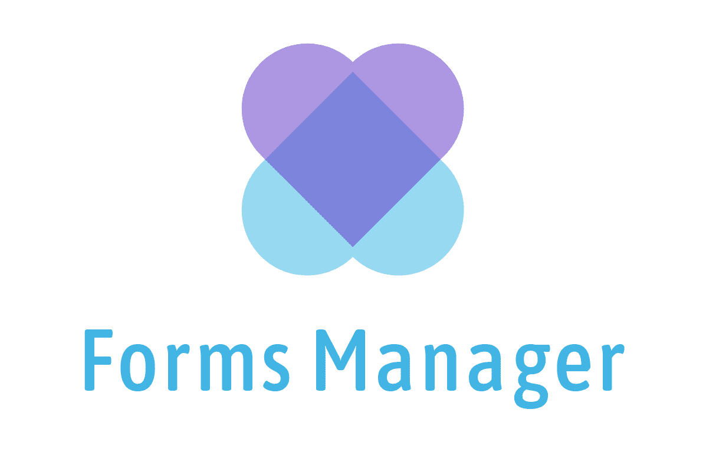

<br />

<p align="center">
 
</p>

> The Foundation for Proper Form Management in Angular

[](https://travis-ci.org/ngneat/transloco)
[]()
[]()
[]()
[](https://github.com/semantic-release/semantic-release)
[](https://github.com/prettier/prettier)
[](#contributors-)

## 🔮 Features

✅ Auto persists the form's state upon user navigation.<br>
✅ Provides an API to reactively querying any form, from anywhere. <br>
✅ Persist the form's state to local storage.

<hr />

`NgFormsManager` lets you sync Angular’s `FormGroup`, `FormControl`, and `FormArray`, via a unique store created for that purpose. The store will hold the controls' data like values, validity, pristine status, errors, etc.

This is powerful, as it gives you the following abilities:

1. It will automatically save the current control value and update the form value according to the value in the store when the user navigates back to the form.
2. It provides an API so you can query a form’s values and properties from anywhere. This can be useful for things like multi-step forms, cross-component validation and more.
3. It can persist the form's state to local storage.

The goal in creating this was to work with the existing Angular form ecosystem, and save you the trouble of learning a new API. Let’s see how it works:

First, install the library:

## Installation

```
npm i @ngneat/forms-manager
```

Then, create a component with a form:

```ts
import { NgFormsManager } from '@ngneat/forms-manager';

@Component({
  template: `
   <form [formGroup]="onboardingForm">
     <input formControlName="name">
     <input formControlName="age">
     <input formControlName="city">
   </form>
  `
})
export class OnboardingComponent {
  constructor(
    private formsManager: NgFormsManager,
    private builder: FormBuilder
  ) {}

  ngOnInit() {
    this.onboardingForm = this.builder.group({
      name: [null, Validators.required],
      age:  [null, Validators.required]),
      city: [null, Validators.required]
    });

    this.formsManager.upsert('onboarding', this.onboardingForm);
  }

  ngOnDestroy() {
    this.formsManager.unsubscribe('onboarding');
  }
}
```

As you can see, we’re still working with the existing API in order to create a form in Angular. We’re injecting the `NgFormsManager` and calling the `upsert` method, giving it the form name and an `AbstractForm`.
From that point on, `NgFormsManager` will track the `form` value changes, and update the store accordingly.

With this setup, you’ll have an extensive API to query the store and update the form from anywhere in your application:

## API

- `selectValid()` - Whether the control is valid

```ts
const isFormValid$ = formsManager.selectValid('onboarding');
const isNameValid$ = formsManager.selectValid('onboarding', 'name');
```

- `selectDirty()` - Whether the control is dirty

```ts
const isFormDirty$ = formsManager.selectDirty('onboarding');
const isNameDirty$ = formsManager.selectDirty('onboarding', 'name');
```

- `selectDisabled()` - Whether the control is disabled

```ts
const isFormDisabled$ = formsManager.selectDisabled('onboarding');
const isNameDisabled$ = formsManager.selectDisabled('onboarding', 'name');
```

- `selectValue()` - Observe the control's value

```ts
const value$ = formsManager.selectValue('onboarding');
const nameValue$ = formsManager.selectValue('onboarding', 'name');
```

- `selectErrors()` - Observe the control's errors

```ts
const errors$ = formsManager.selectErrors('onboarding');
const nameErros$ = formsManager.selectErrors('onboarding', 'name');
```

- `selectControl()` - Observe the control state

```ts
const control$ = formsManager.selectControl('onboarding');
const nameControl$ = formsManager.selectControl('onboarding', 'name');
```

- `getControl()` - Get the control state

```ts
const control = formsManager.getControl('onboarding');
const nameControl = formsManager.getControl('onboarding', 'name');
```

It returns the following state:

```ts
{
   value: any,
   rawValue: object,
   errors: object,
   valid: boolean,
   dirty: boolean,
   invalid: boolean,
   disabled: boolean,
   touched: boolean,
   pristine: boolean,
   pending: boolean,
}
```

- `selectForm()` - Observe the form state

```ts
const form$ = formsManager.selectForm('onboarding');
```

- `getForm()` - Get the form state

```ts
const form = formsManager.getForm('onboarding');
```

- `hasForm()` - Whether the form exists

```ts
const hasForm = formsManager.hasForm('onboarding');
```

- `patchValue()` - A facade to the original `patchValue` method

```ts
formsManager.patchValue('onboarding', value, options);
```

- `setValue()` - A facade to the original `setValue` method

```ts
formsManager.setValue('onboarding', value, options);
```

- `unsubscribe()` - Unsubscribe from the form's `valueChanges` observable (always call it on `ngOnDestroy`)

```ts
formsManager.unsubscribe('onboarding');
formsManager.unsubscribe();
```

- `clear()` - Deletes the form from the store

```ts
formsManager.clear('onboarding');
formsManager.clear();
```

- `destroy()` - Destroy the form (Internally calls `clear` and `unsubscribe`)

```ts
formsManager.destroy('onboarding');
formsManager.destroy();
```

## Persist to Local Storage

In the `upsert` method, pass the `persistState` flag:

```ts
formsManager.upsert(formName, abstractContorl, {
  persistState: true;
});
```

## Validators

The library exposes two helpers method for adding cross component validation:

```ts
export function setValidators(
  control: AbstractControl,
  validator: ValidatorFn | ValidatorFn[] | null
);

export function setAsyncValidators(
  control: AbstractControl,
  validator: AsyncValidatorFn | AsyncValidatorFn[] | null
);
```

Here's an example of how we can use it:

```ts
export class HomeComponent{
  ngOnInit() {
    this.form = new FormGroup({
      price: new FormControl(null, Validators.min(10))
    });

    /*
    * Observe the `minPrice` value in the `settings` form
    * and update the price `control` validators
    */
    this.formsManager.selectValue<number>('settings', 'minPrice')
     .subscribe(minPrice => setValidators(this.form.get('price'), Validators.min(minPrice));
  }
}
```

## Using FormArray Controls

When working with a `FormArray`, it's required to pass a `factory` function that instruct how to create the `controls` inside the `FormArray`. For example:

```ts
import { NgFormsManager } from '@ngneat/forms-manager';

export class HomeComponent {
  skills: FormArray;
  config: FormGroup;

  constructor(private formsManager: NgFormsManager<FormsState>) {}

  ngOnInit() {
    this.skills = new FormArray([]);

    /** Or inside a FormGroup */
    this.config = new FormGroup({
      skills: new FormArray([]),
    });

    this.formsManager
      .upsert('skills', this.skills, { arrControlFactory: value => new FormControl(value) })
      .upsert('config', this.config, {
        arrControlFactory: { skills: value => new FormControl(value) },
      });
  }

  ngOnDestroy() {
    this.formsManager.unsubscribe();
  }
}
```

## NgFormsManager Config

You can override the default config by passing the `NG_FORMS_MANAGER_CONFIG` provider:

```ts
import { NG_FORMS_MANAGER_CONFIG, NgFormsManagerConfig } from '@ngneat/forms-manager';

@NgModule({
  declarations: [AppComponent],
  imports: [ReactiveFormsModule],
  providers: [
    {
      provide: NG_FORMS_MANAGER_CONFIG,
      useValue: new NgFormsManagerConfig({
        debounceTime: 1000, // defaults to 300
        storage: {
          key: 'NgFormManager',
        },
      }),
    },
  ],
  bootstrap: [AppComponent],
})
export class AppModule {}
```

## Contributors ✨

Thanks goes to these wonderful people ([emoji key](https://allcontributors.org/docs/en/emoji-key)):

<!-- ALL-CONTRIBUTORS-LIST:START - Do not remove or modify this section -->
<!-- prettier-ignore-start -->
<!-- markdownlint-disable -->
<table>
  <tr>
    <td align="center"><a href="https://www.netbasal.com"><br /><sub><b>Netanel Basal</b></sub></a><br /><a href="https://github.com/ngneat/forms-manager/commits?author=NetanelBasal" title="Code">💻</a> <a href="https://github.com/ngneat/forms-manager/commits?author=NetanelBasal" title="Documentation">📖</a> <a href="#ideas-NetanelBasal" title="Ideas, Planning, & Feedback">🤔</a></td>
  </tr>
</table>

<!-- markdownlint-enable -->
<!-- prettier-ignore-end -->

<!-- ALL-CONTRIBUTORS-LIST:END -->

This project follows the [all-contributors](https://github.com/all-contributors/all-contributors) specification. Contributions of any kind welcome!
